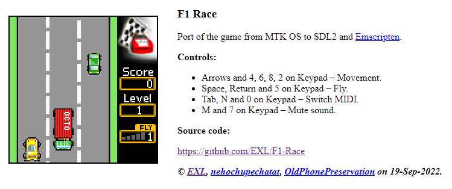

F1 Race
=======



Port of the game from MTK OS to SDL2 and Emscripten.

## Controls

* Arrows and 4, 6, 8, 2 on Keypad – Movement.
* Space, Return and 5 on Keypad – Fly.

## Web Demo

* [F1 Race](https://baat.exlmoto.ru/f1/).

## Build for Linux

```sh
$ sudo apt install build-essential libsdl2-dev libsdl2-mixer-dev
$ make linux
```

## Build for Web

Install [Emscripten](https://emscripten.org/docs/getting_started/downloads.html) first.

```sh
$ source /opt/emsdk/emsdk_env.sh
$ make web
```

## Other Information

Thanks to [@nehochupechatat](https://github.com/nehochupechatat) for source.
